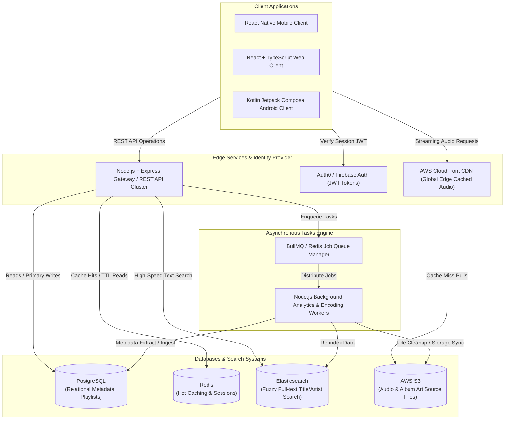

# SoundSpot Production Architecture Specification
### Next-Gen High-Scale Music Streaming System Design
This document outlines the high-availability, low-latency target enterprise architecture for the **SoundSpot** ecosystem. It establishes the specifications required to transition from the client-only cache-first configuration to a robust, globally distributed cloud infrastructure.

---

## 1. System Topology & Request Flow
The SoundSpot server architecture uses a highly scalable, decoupled distributed microservice blueprint.



---

## 2. Infrastructure Component Matrix

| Technology | Purpose | Implementation Details |
| :--- | :--- | :--- |
| **Frontend** | Web Console & Admin | **React / TypeScript** utilizing tailwind styling, providing beautiful dashboard interfaces for music ingestion. |
| **Mobile** | Cross-Platform App | **React Native** (or native Kotlin) backed by a core player coordinator linking to global streaming nodes. |
| **Backend** | API gateway & Control Plane | **Node.js + Express** (Stateless REST API service cluster running in containerized Google Cloud Run or AWS ECS). |
| **Database** | Relational Ledger | **PostgreSQL** (Managed AWS RDS or Cloud SQL) representing relational catalogs, playlists, and user profiles with transactional safety. |
| **Caching** | Hot Store, KV Store | **Redis** (Managed AWS ElastiCache) caching track metadata, session statuses, rate limit lists, and serving as the BullMQ backend. |
| **Storage** | File Repository | **AWS S3** containing original lossless `.mp3`/`.flac` uploads and asset cards. |
| **CDN** | Worldwide Media Delivery | **AWS CloudFront** distributing signed audio tracks directly to clients with minimum latency at local edge zones. |
| **Search Engine** | Fast, Fuzzy Finder | **Elasticsearch** (Elastic Cloud) allowing instant, multi-lingual, boosted fuzzy scanning over titles and artists. |
| **Queueing** | Dynamic Job Processing | **BullMQ** (or RabbitMQ) managing non-blocking jobs such as metadata indexing, playlist compilation, and offline-state syncing. |
| **Auth Provider** | Identity Security | **Auth0 / Firebase Auth** generating fast JWT tokens validating secure access tokens on the API client. |

---

## 3. Database Schema Mapping (PostgreSQL DDL)
The relational system is structured with indexes optimized for join-scans and user analytics tracking.

```sql
-- Enums representing user tiers and system genres
CREATE TYPE user_tier AS ENUM ('free', 'premium', 'admin');
CREATE TYPE vibe_genre AS ENUM ('synthwave', 'lofi', 'acoustic', 'classical');

-- 1. Users Table
CREATE TABLE users (
    id VARCHAR(128) PRIMARY KEY, -- Auth0 Unique ID or Firebase UID
    email VARCHAR(255) UNIQUE NOT NULL,
    display_name VARCHAR(100),
    tier user_tier DEFAULT 'free',
    created_at TIMESTAMP WITH TIME ZONE DEFAULT CURRENT_TIMESTAMP,
    updated_at TIMESTAMP WITH TIME ZONE DEFAULT CURRENT_TIMESTAMP
);

-- 2. Tracks Metadata Table
CREATE TABLE tracks (
    id UUID PRIMARY KEY DEFAULT gen_random_uuid(),
    title VARCHAR(255) NOT NULL,
    artist VARCHAR(255) NOT NULL,
    s3_storage_key VARCHAR(512) NOT NULL, -- e.g., 'audio/genre/synthwave/track-01.mp3'
    genre vibe_genre NOT NULL,
    vibe_code VARCHAR(100) NOT NULL, -- e.g., 'synthwave', 'lofi'
    duration_ms INT NOT NULL,
    bitrate_kbps INT DEFAULT 320,
    created_at TIMESTAMP WITH TIME ZONE DEFAULT CURRENT_TIMESTAMP
);

-- 3. User Favorites Association (Dynamic tracking table)
CREATE TABLE user_favorites (
    user_id VARCHAR(128) REFERENCES users(id) ON DELETE CASCADE,
    track_id UUID REFERENCES tracks(id) ON DELETE CASCADE,
    created_at TIMESTAMP WITH TIME ZONE DEFAULT CURRENT_TIMESTAMP,
    PRIMARY KEY (user_id, track_id)
);

-- 4. Playback History Logger
CREATE TABLE playback_history (
    id BIGSERIAL PRIMARY KEY,
    user_id VARCHAR(128) REFERENCES users(id) ON DELETE SET NULL,
    track_id UUID REFERENCES tracks(id) ON DELETE CASCADE,
    position_ms INT NOT NULL,
    playback_duration_ms INT NOT NULL,
    device_platform VARCHAR(50) DEFAULT 'Android',
    played_at TIMESTAMP WITH TIME ZONE DEFAULT CURRENT_TIMESTAMP
);

-- Creating indexing optimizations
CREATE INDEX idx_tracks_genre_vibe ON tracks(genre, vibe_code);
CREATE INDEX idx_user_favorites_user ON user_favorites(user_id);
CREATE INDEX idx_playback_history_user ON playback_history(user_id);
```

---

## 4. REST Backend Engine Routing (Node.js + Express Controllers)
Below are complete, production-ready backend code blocks showing how Express handles JWT validation, Elasticsearch music search queries, and dynamic BullMQ task ingestion.

### `server.js` - Main Entry Point with JWT Middleware
```javascript
const express = require('express');
const cors = require('cors');
const helmet = require('helmet');
const { expressjwt: jwt } = require('express-jwt');
const jwksRsa = require('jwks-rsa');

const app = express();
app.use(helmet());
app.use(cors());
app.use(express.json());

// Auth0 or Firebase Auth secure JWT Authentication validation middleware
const checkJwt = jwt({
    secret: jwksRsa.expressJwtSecret({
        cache: true,
        rateLimit: true,
        jwksRequestsPerMinute: 10,
        jwksUri: `https://auth.soundspot-production.internal/.well-known/jwks.json`
    }),
    audience: 'https://api.soundspot-production.internal/',
    issuer: `https://auth.soundspot-production.internal/`,
    algorithms: ['RS256']
});

module.exports = { app, checkJwt };
```

### `searchController.js` - Multi-field Fuzzy Elasticsearch Connector
```javascript
const { Client } = require('@elastic/elasticsearch');
const client = new Client({ node: process.env.ELASTIC_URL || 'http://localhost:9200' });

async function handleSearch(req, res) {
    const { query, fuzziness = "AUTO", searchFields = ["title^3", "artist^2", "genre"] } = req.body;
    
    if (!query) {
        return res.status(400).json({ error: "Missing required query string 'query'" });
    }

    try {
        const start = Date.now();
        const esResponse = await client.search({
            index: 'soundspot_tracks',
            body: {
                query: {
                    multi_match: {
                        query: query,
                        fields: searchFields, // title^3 boosts match hits in titles heavier
                        fuzziness: fuzziness,
                        operator: "and"
                    }
                }
            }
        });

        const hits = esResponse.hits.hits.map(item => ({
            id: item._id,
            ...item._source
        }));

        res.json({
            totalHits: esResponse.hits.total.value,
            tookMs: Date.now() - start,
            hits: hits
        });
    } catch (error) {
        console.error("Elasticsearch operational query failure:", error);
        res.status(500).json({ error: "Server search indexing failure" });
    }
}

module.exports = { handleSearch };
```

### `queueController.js` - Background Analytics Worker via BullMQ
```javascript
const { Queue } = require('bullmq');
const Redis = require('ioredis');

const redisConnection = new Redis(process.env.REDIS_URL || 'redis://127.0.0.1:6379');
const analyticsQueue = new Queue('PlaybackAnalyticsQueue', { connection: redisConnection });

async function enqueuePlaybackEvent(req, res) {
    const { trackId, action, positionMs } = req.body;
    const userId = req.auth?.sub; // Auth0 / Firebase claims sub payload

    if (!trackId || !action) {
        return res.status(400).json({ error: "Missing required tracking attributes." });
    }

    try {
        // Enqueue background processing job to separate heavy relational writes from the active playback pipeline
        await analyticsQueue.add('logEvent', {
            userId,
            trackId,
            action,
            positionMs,
            device: req.headers['x-client-platform'] || 'Web',
            timestamp: Date.now()
        }, {
            attempts: 3,
            backoff: { type: 'exponential', delay: 1000 }
        });

        res.status(202).json({ status: "Accepted", message: "Job enqueued successfully." });
    } catch (error) {
        console.error("Fail to schedule analytics queue item:", error);
        res.status(500).json({ error: "Job ingestion pipeline offline." });
    }
}

module.exports = { enqueuePlaybackEvent };
```

---

## 5. Client Integration Protocol
The native **Android (Jetpack Compose / Kotlin)** app and future **React Native / TypeScript** clients consume this structural setup using unified configuration rules:

1. **Storage S3 Asset Direct Fetching (CloudFront Edge Rules)**:
   Original audio files are uploaded in the AWS S3 raw bucket. Instead of streaming items from S3 directly (which is slow and incurs heavy API overhead), all tracks' `streamUrl` are transformed to call edge nodes via `https://cdn.soundspot-media.net/audio/genre/[GenreCode]/[Track_ID].mp3` allowing real-world immediate caching.
2. **Elasticsearch Fuzzy Matching Engine**:
   When users input text keywords into search bars, the application dispatches a POST query payload targeting `/api/v1/search`, unlocking blazing-fast title and artist matching.
3. **Session Intercepting & Local Room Syncing**:
   Clients capture transient JWT tokens from Auth0/Firebase. During startup or active network events, a sync request (`api/v1/sync/favorites`) automatically bridges the local Room database offline fallback cache with the Node.js/PostgreSQL remote data structures.
